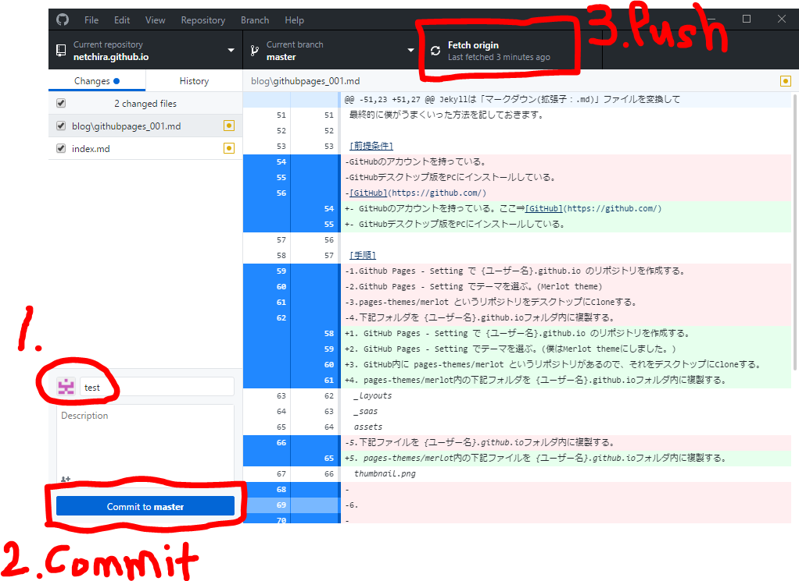

## GitHub Pages 地味に始めにくい説

こんにちは、netchiraです。

今回のテーマは「GitHub Pagesを使ってブログを始めてみよう」です。

皆さんはブログをはじめようと思ったことがありますか。

僕は始める気は無かったです。笑

趣味でPythonを使った便利ツールを開発(作成、と呼ぶ程度か)していて、
最初、「これをオープンソースにしてみよう」と思いました。

でも、ソースを公開するなら、ちょっとした説明を追加して(これが備忘録になる)、
ブログで公開してみようか、と思い始めるようになりました。

ブログを始めるには何が必要なのかググってみました。

そこで浮かび上がった課題は、、、

- HTML・CSSを勉強する必要がある。
- ドメインを取得する必要がある？自分のwebページのためにお金が必要なのか？

・・・といったことでした。

その後、色々ググっていたところ、
「GitHubでもブログが始められる」という情報を入手しました。

その名も、GitHub Pagesです。

まず、GitHub Pagesって何ぞや、という方のために参考URLの紹介です。

[GitHub Pages(本家)](https://pages.github.com/)

この本家のページが紹介している動画を見てみたところ、
どうやら「Jekyll」というツールを使うことで静的webページが簡単に生成できることを知りました。

Jekyllは「マークダウン(拡張子：.md)」ファイルを変換して
静的webページを生成する仕組みをもっているそうです。

早速使ってみようと思います。

### その前に余談
話は飛びますが、マークダウンファイルからWebページを生成するために
Ruby インストールしたり、ローカルでJekyllのビルドを試せるようにチャレンジしたり、
いろいろやってみました。しかし、これらはやらなくてもWebページは生成できることが
分かりました。 
ちなみにGitHub Pagesが対応している各種ツールのバージョンはここで見れます。
[GitHub Pagesが対応している各種ツールのバージョン一覧](https://pages.github.com/versions/)

**はい、ということで、ここでは試行錯誤の末、
最終的にWebページ生成が成功した方法だけを記しておきます。**

### 前提条件
- GitHubのアカウントを持っている。ここ⇒[GitHub](https://github.com/)
- GitHubデスクトップ版をPCにインストールしている。

### 手順
1. GitHub Pages - Setting で {ユーザー名}.github.io のリポジトリを作成する。 

2. GitHub Pages - Setting でテーマを選ぶ。(僕はMerlot themeにしました。)
3. GitHub内に pages-themes/merlot というリポジトリがあるので、それをデスクトップにCloneする。
4. pages-themes/merlot内の下記フォルダを {ユーザー名}.github.ioフォルダ内に複製する。 
 _layouts  _saas  assets 
5. pages-themes/merlot内の下記ファイルを {ユーザー名}.github.ioフォルダ内に複製する。 
 thumbnail.png
6. README.mdファイルを作成する。(GitHubで自動生成することも可) 
テキトーに{ユーザー名}.github.ioの概要説明を記述します。
7. index.mdファイルを作成する。これがブログのトップページになります。

### ブログ公開の手順(Jekyllを使って静的webページを作成・公開する手順)
1. 初めに、_config.ymlファイルに、「theme: jekyll-theme-merlot」と1行記述されていることを確認する。
2. [GitHubの記事](https://help.github.com/articles/configuring-a-publishing-source-for-github-pages/)を参考にして、 
この記事の先頭からEnabling GitHub Pages to publish your site from master or gh-pages の 「4」まで進めれば良いです。 
やってることは結構簡単です。
3. あとは、先ほど編集したレポジトリ({ユーザー名}.github.io)をCommit & Pushするだけです。 

以上でWebページの公開ができました。

なお、リポジトリは「Public(全体へ公開)」になります。 
「Private」にすれば、限られた人だけに公開することができるようですが、 
こちらはGitHub有償サービスですので、使いません。

次回からはPythonで作った便利ツールの公開・紹介をしていこうと思います。

でも、地味にGitHub Pages の始め方が分かりにくかったので、
もう少しGitHubの勉強をして、勉強メモを残していくのもいいかもなあ。

