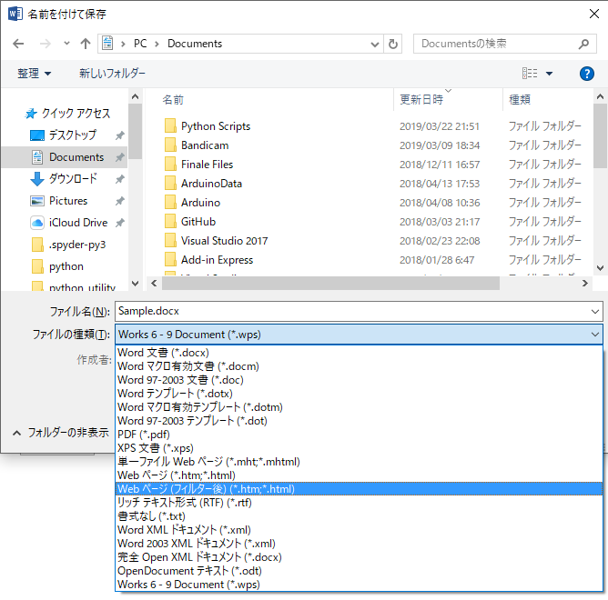

## PythonでRPAを実装しよう(第1回:Wordを使用したファイル変換)

こんにちは、netchiraです。

皆さんはPythonのwin32comというライブラリをご存知ですか？
COMインターフェース経由でPCにインストールされているアプリケーションを起動、終了、そして各種操作を行うことが可能です。
今回はMicrosoft Wordをwin32comで制御し、「いつもは手作業でやっていることをスクリプトで記述して自動化」させたいと思います。

### COMとは
「COM とは」とググッてみてください。色んな情報が見つかるかと思います。
私なりにざっくり説明すると、Windowsで動作するアプリケーションをつくるときに予め外部からも呼びだせるように部分的に機能をコンポーネント化させておく技術のことです。
Pythonでは標準ライブラリとしてwin32comが用意されており、これによりCOMインターフェース経由でWindowsアプリケーションを外部から制御できます。

### 今回の自動化ネタ
今回は、Microsoft Wordを使用してdocxファイルをHTML形式やPDF形式にして「名前を付けて保存」をする作業を自動化したいと思います。

皆さんもWordで作成した文書をPDF化する作業はやったことありますよね？




これです。

まあ、これを自動化するPythonスクリプトを用意して、どんなメリットがあるんだ？って感じですが、とりあえず紹介します。

### Pythonスクリプト
以下、docxをHTMLに変換するPythonスクリプト(関数)です。


```
def ConvertDocx2HtmlUsingWord(DocxFilePath):
    import win32com.client
    import os

    # ファイル拡張子の確認
    if os.path.exists(DocxFilePath) and (DocxFilePath[-5:] == ".docx"):
        # ファイルパスから拡張子(ピリオド含む5文字分)を取り除く
        str_FilePathNoExt = DocxFilePath[0:-5]
        # ファイルの拡張子として".htm"を付与
        str_HtmlFilePath = str_FilePathNoExt + ".htm"
        # ファイルパスとして生成
        HtmlFilePath = os.path.abspath(str_HtmlFilePath)
    else:
        raise UserWarning("File Format is not .docx")
    
    # Wordを起動する : Applicationオブジェクトを生成する
    Application = win32com.client.Dispatch("Word.Application")

    # Wordを画面表示する : VisibleプロパティをTrueにする
    Application.Visible = True

    # 既存文書を開く
    doc = Application.Documents.Open(DocxFilePath)

    # 名前を付けて保存 : ファイル形式を[Webページ(フィルター後)]に指定
    WdFormatHTML = 8
    WdFormatFilteredHTML = 10
    doc.SaveAs2(HtmlFilePath, FileFormat=WdFormatFilteredHTML)

    # 文書を閉じる
    doc.Close()

    # Wordを終了する : Quitメソッドを呼ぶ
    Application.Quit()
```


ここにSaveAs2という関数が登場してくるのですが、FileFormatという引数には数字(定数)を指定すれば色んなファイル形式を選べます。

その定数についての仕様は下記のwebページに記載されています。

[Microsoft VBAリファレンス WdSaveFormat](https://docs.microsoft.com/ja-jp/office/vba/api/word.wdsaveformat)

ちなみに、SaveAs2関数にFileFormatという引数が存在することは、下記のwebページから発見しました。いちおうご紹介。

[Python Programming](https://en.m.wikibooks.org/wiki/Python_Programming/MS_Word)

これらの情報を入手するのに、時間がかかりました…

### なぜHTMLに変換するスクリプトを例にあげたか？
ここからは少し余談です。
Word ファイルに作成されたオートシェイプ(図形)やキャンバスって、HTML化すると全て画像ファイル形式(png)で生成されるのです。
Wordで作成した図形を後で別の用途に使う場合、手っ取り早いです。


### RPAって、どこが？
これで、RPAを実現するためのアプリケーションの「パーツ」が作れたかな、と思っています。
世の中で販売されているRPA(たとえば[コレ](https://www.celf.biz/rpa/)とか)と比べると、たかがWordのファイル変換だけか、というレベルかと思いますが、こういうのをいっぱい作っていけばRPAできるのでは？と個人的に期待しています。


以上です。


