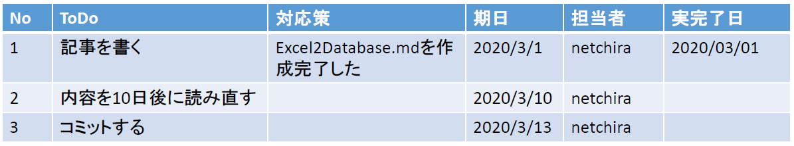

## SQLite3について
こんにちは、netchiraです。

今回は、Pythonで利用可能なsqlite3についてお届けします。


### 前提条件
- Python 3.7 を使用
- 開発環境として Anaconda および Spyderを使用
- Windows 10 (64bit)

### つくってみた
Excelでのデータ管理を卒業すべく、PythonのSQLite3を使ってExcelの特定の行をデータベースに登録し、
dbファイルを生成するスクリプトを設計しました。 

ソースコードは以下を参照ください。


スクリプトの動作の概要を説明します。

前提として、Excelにこんな感じで作ってるとします。



これをSQLで下記のようにTABLEを設計します。

```
CREATE TABLE main (id INTEGER PRIMARY KEY AUTOINCREMENT, data_creation_date DEFAULT CURRENT_TIMESTAMP, todo TEXT, result TEXT, pic TEXT, deadline_date DATETIME, finished_date DATETIME, meeting_title TEXT);
CREATE TABLE sub (meeting_id INTEGER PRIMARY KEY AUTOINCREMENT, data_creation_date DEFAULT CURRENT_TIMESTAMP, meeting_title TEXT, excel_file_name TEXT, excel_update_date DATETIME);
```

main TABLE と sub TABLEをつくってます。名前は何でも良いです。dog TABLE, cat TABLEでも何でもよいです。
今回は、文字通りですが、mainの内容が主となり、subの内容はあってもなくても良い情報をまとめました。
この項目が、Excelでいう1行目のヘッダの内容と対応します。

工夫した点としましては、以下の3点があります。
 - 先頭にidを付けた。(しかも、要素を追加するたびに自動インクリメントするように設定)
 - データを追加した際に、その日時がデータベースに残るようにした。
 - mainとsubには、1つだけ、meeting_titleという項目が重複している。そのため、
SELECT * FROM main INNER JOIN sub ON main.meeting_title = sub.meeting_titleというSQLコマンドを実行することで、
テーブル結合(2つのテーブルをマージした形式で表示させられるようになる)が実行できるようにしている。

sqliteのコマンドの意味や文法などの詳細については、他のサイトで十分詳しく記載されているため、勉強中の私が解説するよりも他の記事が秀逸ですので、
そちらをご一読いただきたいと思います。PRIMARY KEY、AUTOINCREMENT、DEFAULT制約、テーブル結合、INNER JOIN、OUTER JOIN、およびsqliteと
Googleで検索して見つけてください。


### txtファイルにExcelファイルの記載項目を規定
次に工夫した点としては、Excelファイルに記載する項目って、使い始めていたら途中で項目が変わることがありますよね。
内容が変わったり、項目が追加・削除されたり。
そのようなときにPythonスクリプトをいちいち変更していたら面倒！・・・ということで、Excelファイルに規定する内容は
1つのtxtファイルに書いておき、Excelファイルのフォーマットが変わったとしてもすぐに変更できる仕組みをいれました。

```ExcelFormat.txt
[メイン項目]
やるべきこと   : TEXT     : todo               : 2列目
対応方法       : TEXT     : result             : 3列目
担当者名       : TEXT     : pic                : 4列目
期日           : DATETIME : deadline_date      : 5列目
対応完了日     : DATETIME : finished_date      : 6列目
承認者名       : TEXT     : manager            : 7列目
承認日         : DATETIME : checked_date       : 8列目
備考           : TEXT     : note               : 9列目
```

ここでは、承認者名と承認日と備考を追加してみました。
また、このtxtファイル内に、参照するExcelファイル類のファイルパスも記載することとします。
ここに記載されたExcelファイルは、お約束として、すべて同じフォーマットで記載されている必要があります。


### 感想
とりあえず満足しました。
今回は少し解説が少なかった(?)気もしますが、スクリプトの設計にかなりの時間を割きました(汗)。

なお、本スクリプトは色々とテストしてるつもりですが、バグがあったらスミマセン。 ローカルPCで動作させるのに不安を感じられる方は、
ソースコードをコピペして学習用・参考用に閲覧してください。
以上です。
