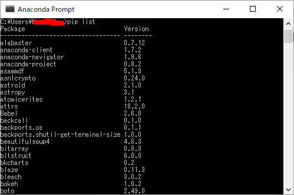
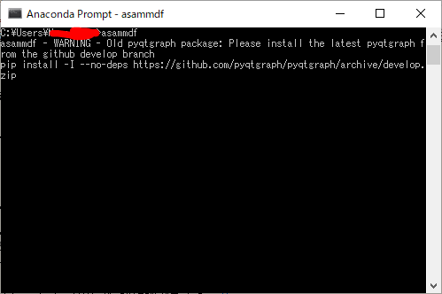

## Pythonを効果的に使え！(asammdf編)
こんにちは、netchiraです。

今回は、GitHub上をネットサーフィンしていて、個人的に特に興味を持ったライブラリを紹介いたします。
今回ご紹介するライブラリは[asammdf]です。

URL：[asammdf repository](https://github.com/danielhrisca/asammdf)  
概要：ASAM MDF/MF4形式ファイルの内容の閲覧ができます。  

### 前提条件
- Windows 10 (64bit)
- Python 3.7
- Anaconda3 2018.12 Windows
- Spyder 3.3.3
- pip install asammdf==5.1.3
- pip install PyQt5==5.11.3
- pip install pyqtgraph==0.10.0

### asammdfについて
以下のURLでasammdfの全貌が明らかとなっております。  
[Welcome to asammdf's documentation!](https://asammdf.readthedocs.io/en/latest/)

そして、以下のURLでは大変カッコイイGUIまで搭載されたasammdf GUIについて紹介されています。  
[asammdf's GUI](https://asammdf.readthedocs.io/en/latest/gui.html)

さて、それではasammdfの使い方について解説していきます！

### 環境について
今回は環境の整備の仕方について説明するだけです。(Pythonのコードは何も書きません)

asammdfって、最近(2019年3月)バージョンが毎日のように更新されております。開発が大変活発である模様です。
そのため、以下に記述する内容のうち、ライブラリの「バージョン」に関しては特に留意していただきたいと思います。

最初にAnacondaのインストールです。
下記URLからダウンロードできます。3.7をインストールしましょう。  
[Anaconda web page](https://www.anaconda.com/distribution/)

すべてデフォルト設定のままインストールして問題ないです。
- ユーザーは自分のみ(Just Me)
- 環境変数PATHには設定しない(チェック入っていないまま)
- パスの自動設定する(チェック入ったまま)

続きまして、WindowsのスタートメニューからAnaconda3を選択し、その中にあるAnaconda Promptをクリックします。
すると、Windowsのコマンドプロンプトのような画面が表示されます。

そこで、下記3つのライブラリをpipを使用してインストールします。

- pip install asammdf==5.1.3
- pip install PyQt5==5.11.3
- pip install pyqtgraph==0.10.0

ライブラリ名の後に[==(version)]とすることで、特定のバージョンをダウンロード・インストールしてくれます。

なお、私は今回、Anaconda環境でasammdfの利用をトライしましたが、asammdfが動作するために必須となるPyQt5の最新版を
インストールすると、Anacondaに付属しているSpyderが、なんと起動できなくなります。(残念！)  

そのため、Spyder 3.3.3 が動作できるPyQt5のバージョンを調べましたので、上記の通りのインストールをお勧めいたします。  

また、pip listとコマンドを入力すると、現在インストールされているライブラリの一覧が確認できます。

さて、3つのライブラリをインストール出来たら、おなじくAnaconda Prompt上で、asammdf.exeと入力しEnterを押します。
すると、asammdfのGUIアプリケーションが起動します。

あるいは、Anaconda3/Scriptsフォルダ内にあるasammdf.exeをダブルクリックから起動してみてください。

もし起動しない場合、下記URLを参考にしてパス設定を手動で行ってください。  
[環境変数：Pathの設定](http://whitecat-student.hatenablog.com/entry/2016/12/28/193156)

そして、これで無事に使えるようになる・・・と思いきや、pyqtgraphのライブラリについてdevelopment branchにあるものを使用してくれ、
とWARNINGが表示されます。ということで、ここは素直に指定されたものをインストールしなおしましょう。  
下記画面は、WARNINGが表示されたときのキャプチャです。

(ということで改めてAnaconda Promptを開き、WARNINGで表示されたpip install -I --no-deps ・・・というコマンドをそのまま入力してあげましょう。
ちょっと長いからタイプミスしないように気を付けてくださいね。)  

ここまでできると、OKでございます。  
どうぞ快適なPythonライフをば。

