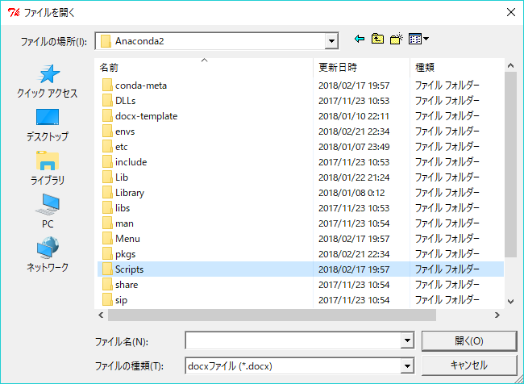
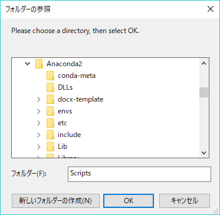

## Pythonで手作業を無くせ！(第1回)
### Microsoft Wordでの手作業を無くす


### 前提条件
Python 2.7 を使用
開発環境として Anaconda および Spyder (3.2.6) を使用


### 処理内容
こんなものを作りました。


やってることは、
- 画像ファイルの拡張子を選択する
- ファイルを選択する
- フォルダーを選択する
- 一番下のボタンをクリックすると、Wordファイルに画像を張り付けていく処理を行う
- エラー時にメッセージ表示(少しだけ)






詳しくは下記ソースを見てください。


### ソースコード
```markdown
# -*- coding: utf-8 -*-
"""
Created on Fri Dec 29 20:28:35 2017
Spyderエディタ
For Python ver 2.7
@author: netchira
"""
import os
import Tkinter      #GUIコントロール
import ttk          #GUIコントロール(Combobox)
import tkFileDialog #ファイル操作
import tkMessageBox #メッセージボックス表示
from docx import Document
from docx.shared import Inches
from glob import glob

#スクリプトの開始
print "Insert Pictures In Document Start"

#root定義
root = Tkinter.Tk()
root.title(u"画像ファイル自動挿入スクリプト")
root.geometry("600x150")

#root上のグローバル変数定義
g_PictureType =Tkinter.StringVar()
g_PictureType.set('type')#変数の初期化
g_DocumentFile =Tkinter.StringVar()
g_DocumentFile.set('file_name')#変数の初期化
g_PictFolderPath =Tkinter.StringVar()
g_PictFolderPath.set('folder_name')#変数の初期化

#色の定義
BLACK = '#000000'
RED = '#ff0000'
PINK = '#ffaacc'

#挿入する画像のサイズ指定(横幅：width)
PICTURE_SIZE = Inches(4.00)

"""
 呼び出し元：ボタン1
 関数の処理内容：Wordファイルを選択する
"""
def SelectDocFile(event):
    global g_DocumentFile
    #ファイルを選択する
    fTyp = [("docxファイル",".docx"),("docファイル",".doc"),("すべてのファイル",".*")]
    iDir = os.path.abspath(os.path.curdir)
    #tkMessageBox.showinfo('Wordファイル選択','ファイルを選択してください。')
    filepath = tkFileDialog.askopenfilename(filetypes = fTyp,initialdir = iDir)
    g_DocumentFile.set(filepath)
    Entry1.configure(textvariable = g_DocumentFile)

"""
 呼び出し元：ボタン2
 関数の処理内容：画像ファイルが格納されているフォルダを選択する
"""
def SelectFolder(event):
    global g_PictFolderPath
    #フォルダを選択する
    iDir = os.path.abspath(os.path.curdir)
    #tkMessageBox.showinfo('フォルダ選択','画像ファイルが格納されているフォルダを選択してください。')
    folderpath = tkFileDialog.askdirectory(initialdir = iDir)
    g_PictFolderPath.set(folderpath)
    Entry2.configure(textvariable = g_PictFolderPath)
    
"""
 呼び出し元：ボタン3
 関数の処理内容：Wordファイルに画像を挿入する
"""
def InsertPictureFiles(event):
    global g_DocumentFile
    global g_PictFolderPath
    global g_PictureType
    l_file   = g_DocumentFile.get()
    l_folder = g_PictFolderPath.get()
    l_type   = g_PictureType.get()
    
    #ファイルの所在の確認
    l_flag1 = os.path.exists(l_file)
    l_flag2 = os.path.exists(l_folder)
    
    if l_flag1 and l_flag2:
        # Wordファイルを開く
        #document = Document()　#docxファイルの新規作成
        document = Document(l_file) #docxファイルの読み込み
        
        # 画像ファイルのみのリストを作成する
        pict_path = l_folder + '/*'
        pict_path += l_type
        picts = glob(pict_path)
        
        #docxファイルの編集処理
        for pict in picts: 
            #箇条書きの挿入
            pict_name = GetFileName(pict)
            document.add_paragraph(pict_name, style='ListBullet')
         
            #画像の挿入
            document.add_picture(pict, width=PICTURE_SIZE)
            
            #改行
            document.add_paragraph()
            
            #改ページ
            #document.add_page_break()
    
        #新しくdocxファイルを保存
        newdoc = l_folder + "\demo_new.docx"
        document.save(newdoc)
        
        #スクリプト処理の成功
        print "Insert Pictures Success!"
        tkMessageBox.showinfo('Success', "Wordファイルに画像を挿入しました。")

    elif l_flag2:
        #存在していなかったファイルの表示
        dispmsg = "下記ファイルが存在していませんでした。再度、ファイルを選択してください。\n"
        dispmsg += (l_file + "\n")
        tkMessageBox.showinfo('Wordファイルが見つかりません', dispmsg)

    elif l_flag1:
        #存在していなかったファイルの表示
        dispmsg = "選択したフォルダが存在していませんでした。再度、フォルダを選択してください。\n"
        dispmsg += (l_folder + "\n")
        tkMessageBox.showinfo('画像を格納したフォルダが見つかりません', dispmsg)
    
    else :
        tkMessageBox.showinfo('スクリプトが実行できません', "ファイル名、フォルダを正しく指定してください。\n")


#ラベル1(textblock)を配置
dispmsg = u"Wordファイルと、画像ファイルが格納されたフォルダを選択してください。その後、画像挿入をクリックしてください。"
Label1 = Tkinter.Label(text=dispmsg, foreground=BLACK, background=PINK)
Label1.place(x=0, y=0)

#ラベル2(textblock)を配置
Label2 = Tkinter.Label(text=u'拡張子：', width=10, anchor=Tkinter.W)
Label2.place(x=30, y=30)

#コンボボックス(combobox)を配置
Combobox= ttk.Combobox(width=10, textvariable=g_PictureType)
Combobox.bind('<<ComboboxSelected>>')
Combobox['values']=('.png','.jpeg','.bmp')
Combobox.set('.png')
Combobox.place(x=90, y=30)

#ボタン1(button)を配置
Button1 = Tkinter.Button(width=10, text=u'ファイル選択')
Button1.bind("<ButtonRelease-1>",SelectDocFile) #左クリックされると関数を呼び出すようにバインド
Button1.place(x=0, y=60)
    
#ボタン2(button)を配置
Button2 = Tkinter.Button(width=10, text=u'フォルダ指定')
Button2.bind("<ButtonRelease-1>",SelectFolder) #左クリックされると関数を呼び出すようにバインド
Button2.place(x=0, y=90)

#ボタン3(button)を配置
Button3 = Tkinter.Button(width=10, text=u'画像挿入')
Button3.bind("<ButtonRelease-1>",InsertPictureFiles) #左クリックされると関数を呼び出すようにバインド
Button3.place(x=0, y=120)
    
#エントリー1(textbox)を配置
Entry1 = Tkinter.Entry(width=80, textvariable=g_DocumentFile)
Entry1.place(x=90, y=60)
    
#エントリー2(textbox)を配置
Entry2 = Tkinter.Entry(width=80, textvariable=g_PictFolderPath)
Entry2.place(x=90, y=90)

"""
関数の処理内容：ファイルのフルパスから拡張子を除いたファイル名だけを返す
"""
def GetFileName(file_path):
    split_str = file_path.split('\\')
    file_name_ext = split_str[len(split_str) - 1]
    temp = file_name_ext.split(".")
    file_name = temp[0] # 拡張子のないファイル名を取得
    return file_name
    
#mainloop
root.mainloop()

```

以上です。
これで、何かの時にラクできるかも♪
