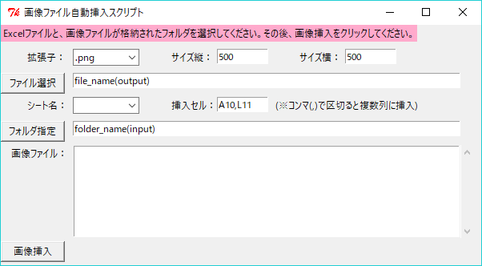

## Pythonで手作業を無くせ！(第2回:Excelに画像ファイルを自動挿入していく)
こんにちは、netchiraです。

今回は、Microsoft Excelでの作業を一部だけ自動化するスクリプトを作成しました。
前回はWordのファイルに対して画像を挿入していくスクリプトでしたが、今回はExcelのファイルに対するスクリプトです。

### 前提条件
- Python 2.7 を使用
- 開発環境として Anaconda および Spyderを使用
- 下記モジュールをAnacondaにインストール

pip install openpyxl 

### 処理内容
このアプリケーションですが、以下のように使えます。

- ユーザー操作：画像ファイルの拡張子を選択する
- ユーザー操作：画像挿入先のExcelファイル(.xlsx/.xlsm)を選択する
- ユーザー操作：挿入したい画像が格納されているフォルダーを選択する
- ユーザー操作：一番下のボタンをクリックする
- スクリプト処理：Excelファイルに画像を張り付けていく処理を行う
- スクリプト処理：ユーザー操作の不備があったときにエラーメッセージ表示

GUIアプリケーションを作成するために、Tkinter, ttkを使用しました。
Tkinter, ttkの注意点などは前回の記事(Wordに画像を貼り付ける)にちょっとだけ書きましたので宜しければご覧ください。

※正直なところ、今回はGUIアプリケーションとして「使い勝手はイマイチ」な感じです。UI用の部品(Entry, Label, Button, Combobox等)が増えてくるとユーザーの操作パターンが増えるので、スクリプトの検証作業が一気に大変になることに気付きました。(←当たり前ですが)
しかし、あまり検証に時間をかけていないせいで、よく途中でアプリケーションが停止します。笑

### 工夫した点(処理)
個人的に一番注力した箇所は、画像ファイルをExcelに貼り付けていく際にnumpyライブラリを使って画像の貼り付け位置を算出(導出)する実装にトライしました。

ということで、ユースケースと合わせて下記に例をあげて本スクリプトの動作を説明したいと思います。

[使用例]
ユースケース→画像ファイル7個をExcelファイルのSheet1に貼り付けたい。
画像のサイズ(縦、横)→特に指定しない。
画像挿入セルの位置→A1, J1

[スクリプトの処理について]
画像挿入先のExcelファイルを指定すると、そのファイルが有するシートを取得し、コンボボックスに表示するように実装しました。
ユーザーはExcelファイルを指定した後、シート名を選択してください。

その後、画像挿入セルの位置を「A1, J1」とします。
このように設定することでA列とJ列(計2列)に対して画像貼り付けを実行することを考えます。
また、今回貼り付ける画像ファイルは7個なので、即ち、画像を並べる「行数」は計4行となります。

本スクリプトでは、この「4行2列の行列」をnumpyライブラリで生成することができるarrayで扱い、画像貼り付け位置を算出していきます。

ざっくりですが下記図中の緑の丸のところに画像を貼り付けるイメージ。

※これを以後、「画像貼り付け位置行列」と呼ぶこととします。
※今回は説明を簡素化するために、行は「1, 11, 21, 31」としましたが、本スクリプトではユーザーが指定した画像サイズ(縦)に依存して行数が自動的に決まります。

CalculatePosition()関数にて、ユーザーが指定した画像挿入セルの位置(A1,J1)をコンマ区切りでカウントします。この2という値を「画像貼り付け位置行列」の列の数と呼びます。また、今回貼り付ける画像ファイルは7個なので、「画像貼り付け位置行列」の行の数は4となります。

次にget_number_list()関数を実行し、画像挿入セルの位置(A1, J1)から数字の部分のみを所得します。
今回はリスト[1, 1]が得られます。

そしてリスト[1, 1]を「画像貼り付け位置行列」の行数(=4)だけ繰り返して(np.tile)以下のような行列(base_array)を生成する。
[[1, 1],
[1, 1],
[1, 1],
[1, 1]]

1つの画像の縦のサイズと画像貼り付け位置行列の行数を使用して、Excel上で画像を貼り付ける位置のオフセット量を表現した行列を生成。
1列分生成した後、それを必要な列数リピート(np.repeat)する。
今回の場合、以下のような行列を得る。
[[0, 0],
[10, 10],
[20, 20],
[30, 30]]

そしてこれまでに生成した上記2つの行列を足し合わせる。
る。
[[1, 1],
[11, 11],
[21, 21],
[31, 31]]

これで「画像貼り付け位置行列」が生成できたので、あとはこれにユーザーが初めに指定した画像挿入セルの位置「A1, J1」より列を表す文字「A, J」を付与して生成した
[[A1, J1],
[A11, J11],
[A21, J21],
[A31, J31]]
を画像貼り付け位置として扱います。
ただし、画像を貼り付ける際にはこれをnumpy行列ではなく、単純なリストとして捉え直しました。
[A1, J1, A11, J11, A21, J21, A31, J31]
(numpy行列は数値しか扱えない。AやJなどの文字列を含んだ要素はnumpy行列として生成できない。)

そして、今回貼り付ける画像の数は7個なので、このリストのうち、先頭から数えて7個だけを取得し、それを最終的な画像貼り付け位置リストとして本関数のリターンとします。

こんな感じでnumpyを利用して、Excelに対して画像を貼り付ける位置を導出してみました。

### 工夫した点(GUI)
GUIを作成するためにTkinterを使用しています。
基本的にはウィジェットをplaceプロパティで指定してGUIを配置していきましたが、
一番苦戦したのは、ListBox + ScrollBarを思い通りに配置するところでした。

ListBox と ScrollBar は別々のウィジェットで、両者をバインドするために
- ttk.Scrollbar宣言時のcommandプロパティにListbox.yviewをセットする。
- Listbox['yscrollcommand']にScrollbarをセットする。
という処理を実行する必要があります。

そのうえで、上記ウィジェットを隣り合わせに配置し、ListBoxの高さに合わせてスクロールバーの高さが同じになるように
実装するのが地味に面倒臭かったです。

結論としては、
- ListBoxとScrollbarを配置するために、事前にFrameを用意する。
- ListBox.gridにて配置(※placeプロパティは使用しない)。
- Scrollbar.gridにて配置。この時、stickyプロパティも指定する。
という処理を実行する必要がありました。

### ソースコード
下記にコミットしていますので、ご興味ある方はぜひご覧ください。
[InsertPicturesInExcel.py](https://github.com/netchira/netchira.github.io/blob/master/python/InsertPicturesInExcel.py)

### 感想
これまでずっとnumpyで行列演算をやってみたかったので今回で1つの実績(経験)が積めて個人的には満足です。

なお、本スクリプトは色々とテストしてるつもりですが、バグがあったらスミマセン。
ローカルPCで動作させるのに不安を感じられる方は、ソースコードをコピペして学習用・参考用に閲覧してください。

また今後、何かしら便利ツールを作って、こんな感じで備忘録がてらブログを綴っていきたいと思います。
以上です。

### 参考URL
[openpyxl](https://pypi.org/project/openpyxl/)
